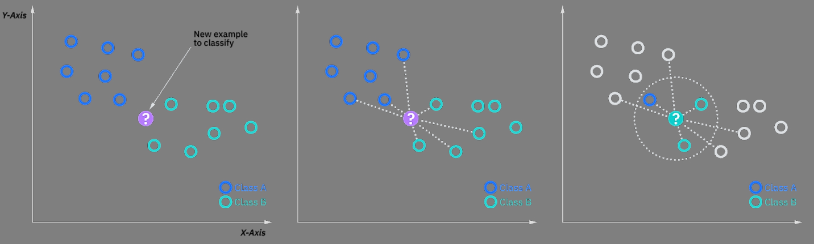

# ECS 171 Group Project: Red-Wine Quality

## Group members:
Oscar Hernandez, Caroline Li, Mardan Mahmut, Matthew Schulz, Rishi Thakkar

## 1. Introduction
[Data Source](https://archive.ics.uci.edu/ml/datasets/Wine+Quality) (Red wine only)

### Data Features (12 total):
 - fixed acidity
 - volatile acidity
 - citric acid
 - residual sugar
 - chlorides
 - free sulfur dioxide
 - total sulfur dioxide
 - density
 - pH
 - sulfates
 - alcohol
 - quality (score between 0 and 10)

 ### Group Project Abstract
- This data on red-wine was gathered in Northern Portugal. It contains physicochemical qualities of wine as well as a subject value on quality ranging from 0-10.  
- We can create a model that uses the physicochemical attributes to determine whether a red wine will be good or not. 
- Then, to determine this we will convert quality values to 1, if they are above a threshold such as 7 or 8, and if they are below convert them to 0. 
- We will then use logistic regression to create a model that can predict quality; furthermore, we can create a correlation matrix and model coefficients on a scatterplot to see which attributes strongly affect the taste of red wine. 
- This model can be used to determine which factors significantly influence the quality of red wine to improve flavor and can help create a guideline on what values each component should have. 
- Also, if the wine were to taste bad, then these attributes could be checked under the model to determine which characteristic is negatively affecting the flavor.
- Another model can be created using KNN, which could be used to classify wine as either good or bad with the given features.

## 2. Submission History
  - [Link to submission history on GitHub](https://github.com/Apolloscar/ECS171_GroupProject/commits/main)

## 3. Code Uploaded
  - [Link to full ipynb on GitHub](https://github.com/Apolloscar/ECS171_GroupProject/blob/main/Project.ipynb)
  - [Link to Data Exploration on GitHub](https://github.com/Apolloscar/ECS171_GroupProject/blob/main/Code_Sections/DataExploration.ipynb)
  - [Link to Preprocessing on GitHub](https://github.com/Apolloscar/ECS171_GroupProject/blob/main/Code_Sections/DataPreprocessing.ipynb)
  - [Link to Model 1 on GitHub](https://github.com/Apolloscar/ECS171_GroupProject/blob/main/Code_Sections/Model1_Logistic.ipynb)
  - [Link to Model 2 on GitHub](https://github.com/Apolloscar/ECS171_GroupProject/blob/main/Code_Sections/Model2_KNN.ipynb)

## 4. Write Up
### A. Introduction
  - We chose to build a project around determining the main factors contributing to a red-wine's quality because we wanted to relate what we learned in class to something completely unrelated. We wanted to show the versatility of topics that machine learning can be applied to. If we can build a model to effectively predict red-wine quality based on its physicochemical attributes, then we can determine the qualities that heavily influence the grade of red-wine. This information can then be used in industry to allow producers to focus on fine tuning attributes, which will produce the highest quality product, and as a result increase the price at which they can sell their red-wine.
 
### C. Methods
-  [Link to full ipynb on GitHub](https://github.com/Apolloscar/ECS171_GroupProject/blob/main/Project.ipynb)

  #### Data Exploration
   - [Link to Data Exploration on GitHub](https://github.com/Apolloscar/ECS171_GroupProject/blob/main/Code_Sections/DataExploration.ipynb)
   - To explore our dataset we executed the following:
     - Printed the data type of each column in our dataframe.
     - Checked if any of the features had missing values.
     - Used the describe() function and created a pairplot.
     - Generated a correlation matrix in the form of a heatmap.

   #### Preprocessing
   - [Link to Preprocessing on GitHub](https://github.com/Apolloscar/ECS171_GroupProject/blob/main/Code_Sections/DataPreprocessing.ipynb)
   - First, we created a new column named **target**, iterated through the **quality** column, and populated the **target** entries with 0 if the element in the **quality** column was less or equal to **quality**'s median value and 1 otherwise. 
   - We then dropped the **quality** column and added **target** to the dataframe. 
   - Finally, we oversampled the **target** data, and utilized MinMax to scale.
   #### Model 1: Logistic Regression
   - [Link to Model 1 on GitHub](https://github.com/Apolloscar/ECS171_GroupProject/blob/main/Code_Sections/Model1_Logistic.ipynb)
   - For our first model, we built it using logistic regression.
   - Using the resampled, scaled data, we trained the model.
   - We then predicted yhat of both training and testing data.
   - After, we found the MSE and printed a classification report.
   - Finally, we created a scatterplot with coefficients from the model and printed their values.

   #### Model 2: KNN Classification
   - [Link to Model 2 on GitHub](https://github.com/Apolloscar/ECS171_GroupProject/blob/main/Code_Sections/Model2_KNN.ipynb)
   - Second model, KNN was used to clasify wine as either good or bad.
   - We tested models with different K-values and recorded their acurracies.
   - Then, we chose K with highest accuracy and used it for model.
   - After, we predicted yhat for both training and testing data.
   - And finally, we calculated the MSE and printed a classification report with these values.

### D. Results
#### Model 1: Logistic Regression
   
   - From the MSE of training and testing, it is observed that the model provided is neither overfitting nor underfitting; training MSE is low and both training MSE and testing MSE are relatively close in value.

| Data      | MSE     |
| --------  | ------  |
| Training  | 0.1823  |
| Testing   | 0.225   |

   - From the coefficient scatterplot, it is shown that the feature with the most impact in reaching good quality is alcohol since it has the highest magnitude value. 

| Features              | Coefficients  |
| -----------           | -----------   |
| Fixed Acidity         | 2.40104666    |
| Volatile Acidity      | -4.01183912   |
| Citric Acid           | 0.33981768    |
| Residual Sugar        | 1.16270763    |
| Chlorides             | -2.62511007   |
| Free Sulfur Dioxide   | 0.07871166    |
| Total Sulfur Dioxide  | -4.31185535   |
| Density               | -2.12932732   |
| pH                    | 0.04099653    |
| Sulphates             | 4.69369245    |
| Alcohol               | 5.68847506    |

 #### Model 2: KNN Classification
   
   - It was determined that a K-value of 39 gave us the most accurate model.
   - Given the MSE from training and testing of the model, it is believed that the model is slightly overfitting due to training MSE being low and testing MSE being relatively high.

| Data      | MSE     |
| --------  | ------  |
| Training  | 0.157   |
| Testing   | 0.290   |

### E. Discussion
  #### Data Exploration
  - As a result of our exploration, we determined that no data needed to be dropped since all of the features were of the same type, and no observations needed to be removed because no data was NULL. Furthermore, by utilizing the information from describe(), the pairplot, and the heatmap we were able to view statistics about our data; for example, the central tendencies, dispertion, shape of our dataset's distributions, and realtionship between the features.
  #### Data Preprocessing 
  - We created a new feature, ***target***, and popluated it with values of zero or one in order to replce the quality column. This was done to be able to use logistic regression as a method to predict if a red-wine is good or not. 
  
  - The above figure is helpful in vizualizing logistic regression. Since our model aims to classify red-wine as good or not, we need to create a ***target*** column with values one (good) or zero (bad). Also, we chose this method over linear regression in order to have a more accurate, adaptive model.
   
  - After this, we noticed the frequency of ones in the **target** column was much lower than the frequency of zeroes. To address this, we oversampled our traning data before building the model, so enough data could be present in each of the **target** classes to better train the model.
  #### Model 1: Logistic Regression
  - We wanted to figure out which of the features given in the data had the most impact in affecting the quality of wine. For that reason, logistic regression was used in order to get the coefficients for each feature from the model. After the model we deduced that alcohol was the biggest contributor in quality since it had the highest coefficient. This makes sense with alcohol being the most reviewed feature of wine by consumers. As compared to residual sugar and citric acid, more often than not, a consumer will mostly just check the amount of alcohol in wine. 
  - As for the credibility of this model, it is best to not fully trust it, but rather to be taken into consideration. Just because alcohol has the best impact on quality, it does not mean that more alcohol will guarantee better quality since there is a limit to how much a human can consume. Also, the data had limited ranges such as with quality only having values from 3-8, giving us a small amount of good quality wine data. This lack of variety will make it hard  for the model to be able to predict values outside of this range. 
  
  #### Model 2: KNN Classification
  
  - This figure is helpful in vizualizing KNN classification. KNN assumes that similar data exist in close proximity, and utlitizes this assumption to classify data into a class.
  - With this in mind, after testing out different k values between the range of 21 to 61, we found that the K-value of 39 gave use the most accurate model. With model's K = 39, we found it to be slightly overfitting due to the low training MSE and relatively high testing MSE. However, the model supported the findings from the first model that alcohol was the best indicator of a wine's quality.
  - The credibility of this model, similarly to model 1, should be taken with a grain of salt. Correlation is not causation; just because the alcohol level is higher in a wine this will not make its quality better as there is a limit to how high a level of alcohol humans can tolerate. Also, other factors during the aging process, such as time aged, and type of wooden barrel used can affect the alcohol level, which may be better indicators of wine quality that are not seen in our dataset.
  

### F. Conclusion
  - This project has been very eye-opening and informative. Being able to create a model from begining to end has reinforced key topics we have learned this quarter. In the future, we can apply different preprocessing techniques to our model to improve performace, and utilize different methods to predict red-wine quality. Even though some areas still needs improvement, we have developed a well-rounded, adaptive model than can accurately predict the quality of red-wine based on physicochemical features.

### G. Collaboration
- Everyone gave feedack in all steps of the project, and did quality work.
  - Oscar Hernandez (Coder, Writer, Team Lead):
    - Added report for model 2.
    - Wrote model 1 results.
    - Worked on model 1 code.
  - Caroline Li (Coder):
    - Worked on model 1 code.
  - Mardan Mahmut (Coder, Writer):
    - Wrote model 2 discussion.
    - Worked on model 2 code.
  - Matthew Schulz (Team Lead, Coder, Writer, Project Manager):
    - Organized, created comments, and added code to project.
    - Structured, organized, edited, and contributed/finalized README.
    - Added ToDos within README and project files to specify to teammmates tasks that needed to be completed.
  - Rishi Thakkar (Coder, Writer):
    - Worked on model 2 code
    - Wrote model 2 preprocessing
